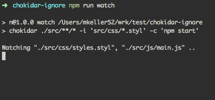

Chokidar-cli ignore
===================

A quick repo to show a potential error in chokidar-cli

## Installation

```
npm install
```

## Usage

This will watch everything in the `src/` folder, ignoring `src/css/*.styl` and run `npm start` on file change.

```
npm run watch
```

On my system this prints out the following display, that says it is watching `"./src/css/styles.styl"`



If you modify that file, however, `npm start` will not run. It is being properly ignored despite the console message.

If you modify `src/js/main.js`, the `npm start` command will run and you will see corresponding console output.